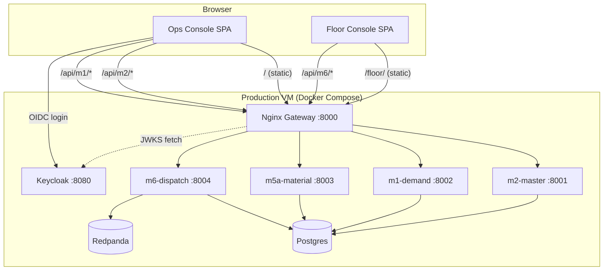

# Design Document: Frontend-Backend Integration

## Overview

This design integrates the Zedral MES platform's two frontend applications (ops-console and floor-console) with the live backend stack. The integration covers five major areas:

1. **Keycloak OIDC Authentication** — ops-console gains full OIDC login/logout/token-refresh via the `keycloak-js` adapter.
2. **Authenticated API Client** — ops-console's existing `apiFetch` is extended with Bearer token injection and 401 retry logic.
3. **Floor Console Service Layer** — a new abstraction layer replaces direct mock imports in the Zustand store with async functions that can target either mocks or the live API.
4. **Backend JWT Validation** — the existing `require_auth` dependency in `zedral_common/auth.py` is completed with full `python-jose` RS256 verification.
5. **Nginx Single-Origin Serving** — nginx is reconfigured to serve both frontends as static files and proxy `/api/*`, eliminating CORS.
6. **CI/CD Pipeline** — GitHub Actions is updated to build frontends with production env vars and deploy static assets to the VM via SSH.

All changes preserve the existing mock-mode toggle (`VITE_USE_MOCK`) so local development without a backend remains fully functional.

## Architecture



### Key Architectural Decisions

| Decision | Rationale |
|----------|-----------|
| Single-origin via nginx static serving | Eliminates CORS entirely; simplifies cookie/token handling; one deployment target |
| `keycloak-js` adapter (not custom OIDC) | Official Keycloak library handles code exchange, silent refresh, session iframe |
| Service layer pattern with mock toggle | Preserves developer experience; no backend needed for UI work |
| `python-jose` for JWT validation | Mature library; supports RS256 + JWKS; already referenced in existing TODO |
| SSH-based deployment (not container registry) | Matches existing `deploy-backend` job; minimal infrastructure change |
| Badge-based auth for floor-console | Operators use physical badge IDs, not username/password; backend validates |

## Components and Interfaces

### 1. Auth Module (ops-console)

**File:** `apps/ops-console/src/lib/keycloak.ts`

```typescript
interface KeycloakConfig {
  url: string;       // VITE_KEYCLOAK_URL
  realm: string;     // VITE_KEYCLOAK_REALM
  clientId: string;  // VITE_KEYCLOAK_CLIENT_ID
}

interface AuthModule {
  init(): Promise<boolean>;
  login(): Promise<void>;
  logout(): Promise<void>;
  getToken(): string | undefined;
  refreshToken(): Promise<boolean>;
  isAuthenticated(): boolean;
  getUserRoles(): RBACRole[];
  onTokenExpired(callback: () => void): void;
}
```

The module wraps `keycloak-js` and exposes a singleton. On init, it configures `onTokenExpired` to trigger silent refresh when the token is within 60 seconds of expiry.

### 2. Auth Guard (ops-console)

**File:** `apps/ops-console/src/components/auth/AuthGuard.tsx`

A route-level wrapper component. When `VITE_USE_MOCK` is false, it checks `keycloak.authenticated` before rendering children. If unauthenticated, it calls `keycloak.login()` which redirects to Keycloak.

### 3. Authenticated API Client (ops-console)

**File:** `apps/ops-console/src/services/client.ts` (modified)

```typescript
// Extended apiFetch signature (unchanged externally)
export async function apiFetch<T>(path: string, init?: RequestInit): Promise<T>;
```

Internal changes:
- Before each request, attach `Authorization: Bearer <token>` from the Auth Module.
- On 401 response: attempt `keycloak.updateToken(30)`. If successful, retry once. If refresh fails, redirect to login.

### 4. Floor Console Service Layer

**File:** `apps/floor-console/src/services/index.ts`

```typescript
interface FloorService {
  getDispatchItems(wcId: string): Promise<DispatchItem[]>;
  submitProductionEvent(event: ProductionEvent): Promise<void>;
  reportStoppage(stoppage: StoppageReport): Promise<void>;
  reportReject(reject: RejectReport): Promise<void>;
  getHandover(shiftId: string): Promise<Handover | null>;
  submitHandover(handover: HandoverSubmission): Promise<void>;
  acknowledgeHandover(handoverId: string, comment?: string): Promise<void>;
  validateBadge(badgeId: string): Promise<BadgeValidationResult>;
}

interface BadgeValidationResult {
  valid: boolean;
  token?: string;
  operator?: Operator;
  error?: string;
}
```

**File:** `apps/floor-console/src/services/mock.ts` — returns data from existing `mocks/data.ts`
**File:** `apps/floor-console/src/services/live.ts` — makes HTTP calls to nginx gateway

A factory function selects the implementation based on `VITE_USE_MOCK`.

### 5. JWT Validator (backend)

**File:** `backend/shared/zedral_common/auth.py` (completed)

```python
async def require_auth(request, credentials) -> dict:
    """
    Returns decoded claims dict with keys:
    - sub: str
    - preferred_username: str
    - realm_access.roles: list[str]
    """
```

Changes:
- Add `python-jose[cryptography]` dependency.
- Implement full RS256 decode using cached JWKS.
- Validate `exp`, `iss` (must match `KEYCLOAK_URL/realms/KEYCLOAK_REALM`).
- Return 401 with descriptive messages for invalid signature, expired token, wrong issuer.
- Retain `AUTH_DISABLED=true` bypass returning `{"sub": "dev-user", "preferred_username": "dev", "realm_access": {"roles": ["admin"]}}`.

### 6. Nginx Configuration

**File:** `infra/nginx/nginx.conf` (rewritten)

New location blocks:
- `location /` — serve ops-console static files; `try_files $uri $uri/ /index.html`
- `location /floor/` — serve floor-console static files; `try_files $uri $uri/ /floor/index.html`
- `location /api/` — existing proxy rules (unchanged logic)
- Cache headers: `Cache-Control: public, max-age=31536000, immutable` for `*.js`, `*.css` with content hashes; `Cache-Control: no-cache` for `index.html`

### 7. CI/CD Pipeline

**File:** `.github/workflows/ci.yml` (extended)

New job: `deploy-frontends` (runs in parallel with `deploy-backend`):
1. Checkout → pnpm install → build both apps with production env vars
2. SCP built assets to VM: ops-console → `/var/www/zedral/ops/`, floor-console → `/var/www/zedral/floor/`
3. Nginx reads from these directories (volume-mounted)

## Data Models

### Token Claims (Keycloak JWT payload)

```typescript
interface KeycloakTokenClaims {
  sub: string;                    // User ID
  preferred_username: string;     // Display name
  email?: string;
  realm_access: {
    roles: string[];              // ["admin"] | ["supervisor"] | ["operator"]
  };
  iss: string;                    // "http://keycloak:8080/realms/zedral"
  exp: number;                    // Unix timestamp
  iat: number;
  azp: string;                    // Client ID
}
```

### RBAC Role Mapping

```typescript
type RBACRole = "admin" | "supervisor" | "operator";

function mapKeycloakRole(claims: KeycloakTokenClaims): RBACRole {
  const roles = claims.realm_access.roles;
  if (roles.includes("admin")) return "admin";
  if (roles.includes("supervisor")) return "supervisor";
  return "operator"; // default fallback
}
```

### Floor Console Session

```typescript
interface FloorSession {
  token: string;
  operator: Operator;
  authenticatedAt: string; // ISO timestamp
}
```

### Service Layer Error

```typescript
class ServiceError extends Error {
  readonly status: number;
  readonly message: string;
  
  constructor(status: number, message: string) {
    super(message);
    this.name = "ServiceError";
    this.status = status;
  }
}
```

### Environment Variables (Production)

| Variable | App | Value |
|----------|-----|-------|
| `VITE_USE_MOCK` | both | `false` |
| `VITE_API_BASE_URL` | both | `` (empty — same origin) |
| `VITE_KEYCLOAK_URL` | ops-console | `http://keycloak:8080` (internal) or public URL |
| `VITE_KEYCLOAK_REALM` | ops-console | `zedral` |
| `VITE_KEYCLOAK_CLIENT_ID` | ops-console | `zedral-spa` |
| `AUTH_DISABLED` | backend services | `false` |

## Correctness Properties

*A property is a characteristic or behavior that should hold true across all valid executions of a system — essentially, a formal statement about what the system should do. Properties serve as the bridge between human-readable specifications and machine-verifiable correctness guarantees.*

### Property 1: Role mapping produces valid RBAC role

*For any* array of Keycloak realm role strings (including empty arrays, arrays with unknown roles, and arrays with multiple valid roles), the `mapKeycloakRole` function SHALL always return exactly one valid `RBACRole` value (`"admin"`, `"supervisor"`, or `"operator"`) following the priority order: admin > supervisor > operator (defaulting to operator when no recognized role is present).

**Validates: Requirements 1.7, 3.3**

### Property 2: Service layer error preservation

*For any* HTTP error response with a status code in the range 400–599 and any non-empty error message string, the Service Layer SHALL throw a `ServiceError` whose `status` property equals the original HTTP status code and whose `message` property equals the original error message.

**Validates: Requirements 4.5**

### Property 3: JWT valid decode and claim extraction

*For any* valid JWT payload containing a `sub` string, a `preferred_username` string, and a `realm_access.roles` array of strings, when the token is signed with the correct RS256 private key and has a valid `exp` (in the future) and correct `iss` claim, the `require_auth` validator SHALL return a claims dict containing the exact same `sub`, `preferred_username`, and `realm_access.roles` values.

**Validates: Requirements 6.2, 6.7**

### Property 4: JWT invalid token rejection

*For any* JWT that has an invalid signature (signed with wrong key), OR has an `exp` timestamp in the past, OR has an `iss` claim that does not match the configured Keycloak realm URL, the `require_auth` validator SHALL raise an HTTP 401 error and SHALL NOT return decoded claims.

**Validates: Requirements 6.3, 6.4, 6.6**

## Error Handling

### Authentication Errors (ops-console)

| Scenario | Behavior |
|----------|----------|
| Keycloak unreachable during init | Show connection error screen with retry button |
| Token refresh fails (refresh token expired) | Redirect to Keycloak login; clear session store |
| 401 from API after retry | Redirect to login; show "session expired" toast |
| Network error during API call | Show error toast; do not clear session (may be transient) |

### Authentication Errors (floor-console)

| Scenario | Behavior |
|----------|----------|
| Badge validation fails (invalid badge) | Show "Invalid badge ID" error on login screen |
| Badge validation fails (network error) | Show "Cannot reach server" error with retry option |
| Session token expired during operation | Queue event locally; show "reconnecting" indicator |

### Backend JWT Validation Errors

| Scenario | HTTP Response |
|----------|--------------|
| Missing Authorization header | 401 `{"detail": "Missing authentication token"}` |
| Invalid token signature | 401 `{"detail": "Invalid token signature"}` |
| Expired token | 401 `{"detail": "Token has expired"}` |
| Invalid issuer | 401 `{"detail": "Invalid token issuer"}` |
| JWKS fetch failure | 503 `{"detail": "Authentication service unavailable"}` |

### Service Layer Errors (floor-console)

All service layer functions propagate errors as `ServiceError` instances. The Zustand store catches these and updates UI state accordingly:
- 401 → trigger re-authentication flow
- 4xx → display user-facing error message
- 5xx → display "server error" with retry option
- Network error → queue operation for retry when online

## Testing Strategy

### Unit Tests (Example-Based)

| Component | Test Focus |
|-----------|-----------|
| Auth Guard | Renders children when authenticated; redirects when not |
| API Client | Attaches Bearer token; retries on 401; redirects on refresh failure |
| useRBAC hook | Returns store role in live mode; returns env role in mock mode |
| Service Layer (mock) | Returns mock data for each function |
| Service Layer (live) | Calls correct endpoints with correct headers |
| Floor login | Sends badge ID; stores token on success; shows error on failure |
| Env validation | Throws when API_BASE_URL missing in live mode |

### Property-Based Tests

**Library:** `fast-check` (TypeScript, already in ops-console devDependencies) for frontend properties; `hypothesis` (Python, already used in project) for backend properties.

**Configuration:** Minimum 100 iterations per property test.

| Property | Library | Tag |
|----------|---------|-----|
| Property 1: Role mapping | fast-check | `Feature: frontend-backend-integration, Property 1: Role mapping produces valid RBAC role` |
| Property 2: Service error preservation | fast-check | `Feature: frontend-backend-integration, Property 2: Service layer error preservation` |
| Property 3: JWT valid decode | hypothesis | `Feature: frontend-backend-integration, Property 3: JWT valid decode and claim extraction` |
| Property 4: JWT invalid rejection | hypothesis | `Feature: frontend-backend-integration, Property 4: JWT invalid token rejection` |

### Integration Tests

| Scope | Approach |
|-------|----------|
| Nginx routing | Docker-based test: start nginx with static files, verify /, /floor/, /api/* routing |
| End-to-end auth flow | Keycloak test realm + ops-console: verify login → token → API call → response |
| Badge auth flow | Backend + floor-console: verify badge → token → authenticated API call |
| CI/CD pipeline | Dry-run workflow validation; verify build output structure |

### Smoke Tests

| Check | Method |
|-------|--------|
| Keycloak adapter initializes | App loads without error in production config |
| Service layer exports all functions | TypeScript compilation succeeds |
| Nginx serves both apps | `curl /` and `curl /floor/` return HTML |
| AUTH_DISABLED=false in production | Verify docker-compose env var |
| CI workflow structure | YAML lint + job dependency validation |

