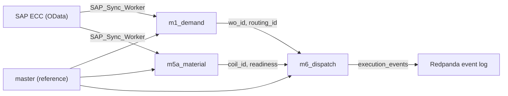

# Design Document — Zedral Database Schema (M2 / M1 / M5a / M6)

## Overview

This document covers the database design for four in-scope modules of the Zedral platform:

- **master** — shared reference data (M2)
- **m1_demand** — demand and order management (M1)
- **m5a_material** — material and inventory control (M5a)
- **m6_dispatch** — dispatch and execution control (M6)

Modules M3, M4, M7, and M8 are deferred and not covered here.

### Deliverable

A single idempotent SQL migration file at `infra/postgres/init/001_zedral_schema.sql` that can be applied to a fresh PostgreSQL 16 + TimescaleDB instance in one command.

### Technology Stack

- **PostgreSQL 16** — primary database engine
- **TimescaleDB** — time-series extension (used by deferred modules M7/M8; extensions still enabled)
- **pgcrypto** — provides `gen_random_uuid()` for UUID primary keys
- **UUID-v7** — time-ordered UUIDs for event IDs (application-generated, stored as UUID type)

### Event-Sourced Architecture Context

Module tables are **materialised views** in the logical sense — they are rebuilt from the Redpanda event log by each module's worker process. The database schema stores the current materialised state. The `m6_dispatch.execution_events` table is the canonical append-only event store for floor execution facts; all other tables reflect derived state.


## Architecture

### Schema Topology

```
PostgreSQL 16 + TimescaleDB
│
├── master              — shared reference data, seeded at deploy time
├── m1_demand           — SAP-sourced sales orders and work orders
├── m5a_material        — coil inventory, stage tracking, shortage forecasting
└── m6_dispatch         — shift dispatch lists, floor events, stoppages, rejects
```

### Cross-Module Data Flow



### Key Design Decisions

1. **Natural keys over surrogates for cross-module FKs** — `wo_id`, `wc_id`, `material_code`, `coil_id` are TEXT natural keys matching SAP identifiers. This avoids join indirection when correlating across modules.
2. **BIGSERIAL for high-volume append-only tables** — `coil_stage_history`, `priority_score_history`, `validation_errors` use BIGSERIAL to avoid UUID overhead on high-insert paths.
3. **UUID (gen_random_uuid) for entity tables** — dispatch lists, execution events, allocations, etc. use UUID PKs for distributed-safe generation.
4. **GENERATED ALWAYS AS STORED columns** — `duration_min`, `is_active`, `variance_min`, `is_overdue` are computed at write time to avoid repeated expression evaluation in queries.
5. **Partial indexes** — used extensively to keep index size small for filtered queries (active stoppages, pending WOs, active allocations).
6. **JSONB for flexible payloads** — `raw_sap_payload`, `payload`, `score_components`, `reserved_coils`, `crew_members` use JSONB to accommodate evolving SAP field sets without schema migrations.
7. **Idempotent migration** — all DDL uses `IF NOT EXISTS` guards; seed data uses `ON CONFLICT DO NOTHING`; hypertable calls are wrapped in exception-catching DO blocks.


## Components and Interfaces

### Migration File Structure

The single migration file `infra/postgres/init/001_zedral_schema.sql` is organised in this section order:

1. Header comment (version, date, description, schema list)
2. Extensions (`timescaledb`, `pgcrypto`)
3. Schema declarations (`CREATE SCHEMA IF NOT EXISTS` for all 4 in-scope schemas)
4. `master` — tables, indexes, seed data
5. `m1_demand` — tables, indexes
6. `m5a_material` — tables, indexes
7. `m6_dispatch` — tables, indexes, config seed data

### Cross-Module Foreign Key References

| Source column | References |
|---|---|
| `m1_demand.sales_orders.customer_id` | `master.customers.customer_id` |
| `m1_demand.sales_order_items.material_code` | `master.materials.material_code` |
| `m1_demand.work_orders.material_code` | `master.materials.material_code` |
| `m1_demand.work_orders.routing_id` | `master.routings.routing_id` |
| `m1_demand.wo_so_link.wo_id` | `m1_demand.work_orders.wo_id` |
| `m5a_material.coils.material_code` | `master.materials.material_code` |
| `m5a_material.coils.parent_coil_id` | `m5a_material.coils.coil_id` (self-ref) |
| `m6_dispatch.dispatch_lists.wc_id` | `master.work_centres.wc_id` |
| `m6_dispatch.stoppages.stoppage_code_id` | `master.stoppage_codes.code_id` |
| `m6_dispatch.rejects.defect_code_id` | `master.defect_codes.code_id` |
| `m6_dispatch.roll_assignments.roll_id` | `master.rolls.roll_id` |
| `m6_dispatch.roll_changes.roll_out_id` | `master.rolls.roll_id` |
| `m6_dispatch.roll_changes.roll_in_id` | `master.rolls.roll_id` |
| `m6_dispatch.roll_changes.wc_id` | `master.work_centres.wc_id` |
| `m6_dispatch.shift_crew_assignments.wc_id` | `master.work_centres.wc_id` |

### SAP Integration Points

- `m1_demand.sap_watermarks` — tracks last-synced timestamp per entity (`work_orders`, `sales_orders`)
- `m5a_material.sap_watermarks` — tracks last-synced timestamp per entity (`mb52_stock`, `mb51_movements`)
- `raw_sap_payload JSONB` columns on `sales_orders`, `work_orders`, `coils` — store the raw OData response for audit and replay


## Data Models

### master schema

#### master.plants
```sql
-- One row per manufacturing site
plant_id    TEXT PRIMARY KEY          -- e.g. 'hsl_ludhiana'
name        TEXT NOT NULL
location    TEXT NOT NULL
timezone    TEXT NOT NULL             -- IANA tz, e.g. 'Asia/Kolkata'
created_at  TIMESTAMPTZ DEFAULT now()
updated_at  TIMESTAMPTZ DEFAULT now()
```
Seed: 1 row — `hsl_ludhiana`, Hero Steels Limited, Ludhiana, Asia/Kolkata.

#### master.work_centres
```sql
-- CRS production lines; gauge/width ranges define capability envelope
wc_id              TEXT PRIMARY KEY
plant_id           TEXT REFERENCES master.plants
name               TEXT NOT NULL
wc_type            TEXT NOT NULL      -- e.g. 'crs_6hi', 'temper'
gauge_min_mm       NUMERIC(6,3)
gauge_max_mm       NUMERIC(6,3)
width_min_mm       INTEGER
width_max_mm       INTEGER
rated_speed_mt_hr  NUMERIC(8,2)
is_active          BOOLEAN DEFAULT TRUE
created_at / updated_at
```
Seed: CRS-1 (0.15–2.0mm, 600–1350mm), CRS-2 (0.15–2.0mm, 600–1350mm), CRS-3 (0.20–3.0mm, 600–1350mm, temper rolling).

#### master.materials
```sql
material_code  TEXT PRIMARY KEY       -- SAP material number
description    TEXT
material_type  TEXT                   -- e.g. 'HR_COIL', 'CR_COIL'
grade          TEXT                   -- e.g. 'IS513-CR1', 'IS513-CR2'
gauge_mm       NUMERIC(6,3)
width_mm       INTEGER
is_active      BOOLEAN DEFAULT TRUE
created_at / updated_at
```

#### master.customers
```sql
customer_id     TEXT PRIMARY KEY      -- SAP customer number
name            TEXT NOT NULL
priority_class  CHAR(1)               -- CHECK IN ('A','B','C')
sap_customer_ref TEXT
created_at / updated_at
```

#### master.routings
```sql
routing_id    TEXT PRIMARY KEY
material_code TEXT REFERENCES master.materials
version       INTEGER DEFAULT 1
is_active     BOOLEAN DEFAULT TRUE
is_multi_pass BOOLEAN DEFAULT FALSE   -- true for 6-HI multi-pass rolling
created_at / updated_at
```

#### master.routing_operations
```sql
routing_id      TEXT REFERENCES master.routings
op_seq          INTEGER
wc_type         TEXT
std_rate_mt_hr  NUMERIC(8,2) NOT NULL
min_qty_mt      NUMERIC(10,3)
max_qty_mt      NUMERIC(10,3)
PRIMARY KEY (routing_id, op_seq)
```

#### master.changeover_matrix
```sql
-- Core scheduling input: (from-state) → (to-state) → setup_min
-- Populated from historical setup timing observations
matrix_id         UUID PRIMARY KEY DEFAULT gen_random_uuid()
wc_id             TEXT REFERENCES master.work_centres
grade_from        TEXT
grade_to          TEXT NOT NULL
gauge_from_mm     NUMERIC(6,3)
gauge_to_mm       NUMERIC(6,3) NOT NULL
width_from_mm     INTEGER
width_to_mm       INTEGER NOT NULL
gauge_step        TEXT               -- 'same','up','down'
width_step        TEXT               -- 'same','up','down'
roll_change_reqd  BOOLEAN DEFAULT FALSE
setup_min         INTEGER NOT NULL   -- CHECK > 0
sample_count      INTEGER DEFAULT 0
last_updated_from TEXT               -- 'seed','observed','planner'
created_at / updated_at
```

#### master.resource_calendars
```sql
-- Shift availability per work centre per day
calendar_id    UUID PRIMARY KEY DEFAULT gen_random_uuid()
wc_id          TEXT REFERENCES master.work_centres
calendar_date  DATE NOT NULL
shift          CHAR(1) NOT NULL      -- 'A','B','C'
shift_start    TIMESTAMPTZ NOT NULL
shift_end      TIMESTAMPTZ NOT NULL
available_hrs  NUMERIC(5,2) NOT NULL -- CHECK >= 0
is_holiday     BOOLEAN DEFAULT FALSE
pm_hrs         NUMERIC(5,2) DEFAULT 0
notes          TEXT
UNIQUE (wc_id, calendar_date, shift)
```

#### master.operator_skills
```sql
operator_id   TEXT NOT NULL
wc_id         TEXT REFERENCES master.work_centres
grade_family  TEXT NOT NULL
certified     BOOLEAN DEFAULT FALSE
certified_at  DATE
PRIMARY KEY (operator_id, wc_id, grade_family)
```

#### master.rolls
```sql
-- v0.2: full roll lifecycle tracking for 6-HI mill
roll_id                  TEXT PRIMARY KEY
wc_id                    TEXT REFERENCES master.work_centres  -- home WC
roll_type                TEXT NOT NULL  -- 'work_roll_top','work_roll_bottom','intermediate','backup'
roll_finish              TEXT           -- surface finish designation
current_wc_id            TEXT REFERENCES master.work_centres
current_position         TEXT           -- 'top','bottom','intermediate_top', etc.
cumulative_tonnage_mt    NUMERIC(10,3) DEFAULT 0  -- CHECK >= 0
tonnage_since_grind_mt   NUMERIC(10,3) DEFAULT 0  -- CHECK >= 0
last_grind_date          DATE
grind_cycle_count        INTEGER DEFAULT 0
expected_life_mt         NUMERIC(10,3)
is_active                BOOLEAN DEFAULT TRUE
created_at / updated_at
```

#### master.stoppage_codes
```sql
-- 7 rollup buckets: breakdown, material_wait, quality_hold,
--                   tool_change, power, operator_break, other
code_id        TEXT PRIMARY KEY
code           TEXT NOT NULL UNIQUE
description    TEXT NOT NULL
rollup_bucket  TEXT NOT NULL  -- CHECK IN (7 values)
is_active      BOOLEAN DEFAULT TRUE
sort_order     INTEGER
created_at / updated_at
```
Seed: 16 Hero Steels codes (see seed data section).

#### master.defect_codes
```sql
code_id          TEXT PRIMARY KEY
code             TEXT NOT NULL UNIQUE
description      TEXT NOT NULL
defect_category  TEXT NOT NULL   -- e.g. 'edge','surface','shape','dimensional'
severity         TEXT            -- 'critical','major','minor'
is_active        BOOLEAN DEFAULT TRUE
sort_order       INTEGER
created_at / updated_at
```
Seed: 20+ Hero Steels codes (see seed data section).

#### master.emission_factors
```sql
factor_id        TEXT PRIMARY KEY   -- e.g. 'cea_grid_FY26'
source           TEXT NOT NULL      -- 'CEA'
fiscal_year      TEXT NOT NULL      -- 'FY2025-26'
scope            CHAR(1) NOT NULL   -- '2' (Scope 2 grid electricity)
kg_co2e_per_kwh  NUMERIC(8,5) NOT NULL
valid_from       DATE NOT NULL
valid_to         DATE
citation         TEXT
created_at / updated_at
```
Seed: `cea_grid_FY26`, 0.82 kgCO2e/kWh, valid_from 2025-04-01.

#### master.line_share_by_family
```sql
wc_id           TEXT REFERENCES master.work_centres
grade_family    TEXT NOT NULL
share_pct       NUMERIC(5,2) NOT NULL
based_on_days   INTEGER
calculated_at   TIMESTAMPTZ DEFAULT now()
PRIMARY KEY (wc_id, grade_family)
```


### m1_demand schema

#### m1_demand.sales_orders
```sql
so_id             TEXT PRIMARY KEY
sap_so_ref        TEXT NOT NULL
customer_id       TEXT NOT NULL REFERENCES master.customers
customer_po_ref   TEXT
order_date        DATE NOT NULL
required_date     DATE NOT NULL
total_qty_mt      NUMERIC(10,3) NOT NULL
status            TEXT NOT NULL  -- 'open','partial','fulfilled','cancelled'
sales_org         TEXT
currency          CHAR(3) DEFAULT 'INR'
net_value         NUMERIC(14,2)
sap_modified_at   TIMESTAMPTZ NOT NULL
ingested_at       TIMESTAMPTZ DEFAULT now()
updated_at        TIMESTAMPTZ DEFAULT now()
version           INTEGER DEFAULT 1
raw_sap_payload   JSONB
```

#### m1_demand.sales_order_items
```sql
so_id             TEXT REFERENCES m1_demand.sales_orders ON DELETE CASCADE
item_no           INTEGER NOT NULL
material_code     TEXT NOT NULL REFERENCES master.materials
grade             TEXT NOT NULL
gauge_mm          NUMERIC(6,3) NOT NULL
width_mm          INTEGER NOT NULL
qty_mt            NUMERIC(10,3) NOT NULL
qty_fulfilled_mt  NUMERIC(10,3) DEFAULT 0
item_required_date DATE
customer_spec_ref TEXT
PRIMARY KEY (so_id, item_no)
```

#### m1_demand.work_orders
```sql
-- Status machine: pending → queued → scheduled → released → in_process → complete
-- Terminal states: cancelled, on_hold, rejected
wo_id              TEXT PRIMARY KEY
sap_wo_ref         TEXT NOT NULL
parent_wo_id       TEXT REFERENCES m1_demand.work_orders  -- for sub-WOs
material_code      TEXT NOT NULL REFERENCES master.materials
grade              TEXT NOT NULL
gauge_mm           NUMERIC(6,3) NOT NULL
width_mm           INTEGER NOT NULL
qty_planned_mt     NUMERIC(10,3) NOT NULL  -- CHECK > 0
qty_confirmed_mt   NUMERIC(10,3) DEFAULT 0
qty_scrap_mt       NUMERIC(10,3) DEFAULT 0
required_date      DATE NOT NULL
planned_start_date DATE
routing_id         TEXT REFERENCES master.routings
routing_valid      BOOLEAN DEFAULT FALSE
priority_class     CHAR(1)
priority_score     NUMERIC(6,3)
priority_manual    BOOLEAN DEFAULT FALSE
priority_reason    TEXT
wo_type            TEXT NOT NULL  -- 'customer','internal','rework'
status             TEXT NOT NULL  -- see status machine above
hold_reason        TEXT
rejection_reason   TEXT
sap_modified_at    TIMESTAMPTZ NOT NULL
ingested_at        TIMESTAMPTZ DEFAULT now()
updated_at         TIMESTAMPTZ DEFAULT now()
version            INTEGER DEFAULT 1
raw_sap_payload    JSONB
```

#### m1_demand.wo_so_link
```sql
-- Many-to-many: one WO can fulfil multiple SO items; one SO item can draw from multiple WOs
wo_id             TEXT REFERENCES m1_demand.work_orders
so_id             TEXT
so_item_no        INTEGER
allocated_qty_mt  NUMERIC(10,3) NOT NULL
PRIMARY KEY (wo_id, so_id, so_item_no)
FOREIGN KEY (so_id, so_item_no) REFERENCES m1_demand.sales_order_items
```

#### m1_demand.priority_score_history
```sql
-- BIGSERIAL: high-volume, append-only audit trail
history_id       BIGSERIAL PRIMARY KEY
wo_id            TEXT NOT NULL REFERENCES m1_demand.work_orders
calculated_at    TIMESTAMPTZ NOT NULL DEFAULT now()
priority_score   NUMERIC(6,3) NOT NULL
priority_class   CHAR(1) NOT NULL
score_components JSONB NOT NULL   -- breakdown of scoring factors
trigger          TEXT NOT NULL    -- 'ingestion','scheduled_recalc','override','event_driven'
triggered_by     TEXT
```

#### m1_demand.priority_overrides
```sql
override_id    UUID PRIMARY KEY DEFAULT gen_random_uuid()
wo_id          TEXT NOT NULL REFERENCES m1_demand.work_orders
override_type  TEXT NOT NULL  -- 'rush','defer','hold','release_hold'
old_score      NUMERIC(6,3)
new_score      NUMERIC(6,3)
reason         TEXT NOT NULL
overridden_by  TEXT NOT NULL
overridden_at  TIMESTAMPTZ DEFAULT now()
expires_at     TIMESTAMPTZ
is_active      BOOLEAN DEFAULT TRUE
```

#### m1_demand.sap_watermarks
```sql
entity              TEXT PRIMARY KEY  -- 'work_orders','sales_orders'
last_synced_at      TIMESTAMPTZ NOT NULL
last_sap_modified   TIMESTAMPTZ NOT NULL
rows_last_pull      INTEGER
duration_ms_last    INTEGER
status_last         TEXT
error_message_last  TEXT
```

#### m1_demand.validation_errors
```sql
-- BIGSERIAL: append-only error log
error_id         BIGSERIAL PRIMARY KEY
wo_id            TEXT NOT NULL REFERENCES m1_demand.work_orders
error_type       TEXT NOT NULL
error_detail     JSONB
detected_at      TIMESTAMPTZ DEFAULT now()
resolved_at      TIMESTAMPTZ
resolution_note  TEXT
```


### m5a_material schema

#### m5a_material.coils
```sql
-- Stage machine: expected → stores → pickling → rolling → annealing → rewind → fg → dispatched
-- Terminal stages: rejected, scrapped
coil_id              TEXT PRIMARY KEY
sap_coil_ref         TEXT
parent_coil_id       TEXT REFERENCES m5a_material.coils  -- slit/split parent
material_code        TEXT NOT NULL REFERENCES master.materials
grade                TEXT NOT NULL
gauge_mm             NUMERIC(6,3) NOT NULL
width_mm             INTEGER NOT NULL
weight_initial_mt    NUMERIC(10,3) NOT NULL
weight_remaining_mt  NUMERIC(10,3) NOT NULL  -- CHECK >= 0 AND <= weight_initial_mt
heat_number          TEXT
supplier             TEXT
manufacturer_lot     TEXT
current_stage        TEXT NOT NULL  -- see stage machine above
is_quality_hold      BOOLEAN DEFAULT FALSE
hold_reason          TEXT
hold_ncr_id          TEXT
is_aged_out          BOOLEAN DEFAULT FALSE
age_check_date       DATE
reserved_for_wo      TEXT
reservation_qty_mt   NUMERIC(10,3)
reservation_set_at   TIMESTAMPTZ
reservation_set_by   TEXT
gr_date              DATE
arrived_at_stores    TIMESTAMPTZ
consumed_at          TIMESTAMPTZ
scrapped_at          TIMESTAMPTZ
dispatched_at        TIMESTAMPTZ
created_at / updated_at
raw_sap_payload      JSONB
```

#### m5a_material.coil_stage_history
```sql
-- BIGSERIAL: append-only stage transition audit
history_id     BIGSERIAL PRIMARY KEY
coil_id        TEXT NOT NULL REFERENCES m5a_material.coils
from_stage     TEXT
to_stage       TEXT NOT NULL
transition_at  TIMESTAMPTZ NOT NULL DEFAULT now()
triggered_by   TEXT NOT NULL  -- 'sap_sync','operator_scan','quality_release','reservation','planner_override'
user_id        TEXT
device_id      TEXT
related_wo_id  TEXT
related_event_id UUID
notes          TEXT
```

#### m5a_material.wo_readiness
```sql
-- Denormalised fast-read: one row per WO, recomputed by M5a worker
wo_id                    TEXT PRIMARY KEY
required_qty_mt          NUMERIC(10,3) NOT NULL
available_qty_mt         NUMERIC(10,3) NOT NULL
expected_qty_mt          NUMERIC(10,3) NOT NULL
shortfall_qty_mt         NUMERIC(10,3) NOT NULL
status                   TEXT NOT NULL  -- 'ready','partial','pending','shortage'
earliest_ready_at        TIMESTAMPTZ
reserved_coils           JSONB
expected_coils           JSONB
shortage_resolution_path TEXT
calculated_at            TIMESTAMPTZ NOT NULL DEFAULT now()
```

#### m5a_material.pre_allocations
```sql
alloc_id        UUID PRIMARY KEY DEFAULT gen_random_uuid()
coil_id         TEXT NOT NULL REFERENCES m5a_material.coils
wo_id           TEXT NOT NULL
allocated_qty_mt NUMERIC(10,3) NOT NULL
priority_class  CHAR(1)
allocated_by    TEXT NOT NULL
allocated_at    TIMESTAMPTZ DEFAULT now()
released_at     TIMESTAMPTZ
release_reason  TEXT
is_active       BOOLEAN DEFAULT TRUE
```

#### m5a_material.inbound_expected
```sql
expectation_id    UUID PRIMARY KEY DEFAULT gen_random_uuid()
coil_id           TEXT REFERENCES m5a_material.coils
sap_doc_ref       TEXT NOT NULL
material_code     TEXT NOT NULL
grade             TEXT NOT NULL
gauge_mm          NUMERIC(6,3) NOT NULL
width_mm          INTEGER NOT NULL
expected_weight_mt NUMERIC(10,3) NOT NULL
supplier          TEXT
expected_at       DATE
is_overdue        BOOLEAN GENERATED ALWAYS AS (expected_at < CURRENT_DATE) STORED
is_received       BOOLEAN DEFAULT FALSE
received_at       TIMESTAMPTZ
notes             TEXT
created_at        TIMESTAMPTZ DEFAULT now()
```

#### m5a_material.shortage_forecast
```sql
forecast_id           UUID PRIMARY KEY DEFAULT gen_random_uuid()
generated_at          TIMESTAMPTZ NOT NULL DEFAULT now()
horizon_days          INTEGER NOT NULL
total_wos_evaluated   INTEGER NOT NULL
total_shortage_wos    INTEGER NOT NULL
total_shortage_qty_mt NUMERIC(12,3) NOT NULL
```

#### m5a_material.shortage_forecast_lines
```sql
forecast_id          UUID NOT NULL REFERENCES m5a_material.shortage_forecast
wo_id                TEXT NOT NULL
required_date        DATE NOT NULL
required_qty_mt      NUMERIC(10,3) NOT NULL
available_qty_mt     NUMERIC(10,3) NOT NULL
expected_qty_mt      NUMERIC(10,3) NOT NULL
shortfall_qty_mt     NUMERIC(10,3) NOT NULL
earliest_remediation TEXT
PRIMARY KEY (forecast_id, wo_id)
```

#### m5a_material.sap_watermarks
```sql
entity              TEXT PRIMARY KEY  -- 'mb52_stock','mb51_movements'
last_synced_at      TIMESTAMPTZ NOT NULL
last_sap_modified   TIMESTAMPTZ
rows_last_pull      INTEGER
duration_ms_last    INTEGER
status_last         TEXT
error_message_last  TEXT
```


### m6_dispatch schema

#### m6_dispatch.dispatch_lists
```sql
dispatch_id   UUID PRIMARY KEY DEFAULT gen_random_uuid()
schedule_id   UUID NOT NULL
wc_id         TEXT NOT NULL REFERENCES master.work_centres
shift_date    DATE NOT NULL
shift         CHAR(1) NOT NULL  -- 'A','B','C'
shift_start   TIMESTAMPTZ NOT NULL
shift_end     TIMESTAMPTZ NOT NULL
generated_at  TIMESTAMPTZ DEFAULT now()
published_at  TIMESTAMPTZ
status        TEXT NOT NULL  -- 'draft','published','superseded','complete'
superseded_by UUID REFERENCES m6_dispatch.dispatch_lists
generated_by  TEXT
UNIQUE (wc_id, shift_date, shift, status) DEFERRABLE INITIALLY DEFERRED
```

#### m6_dispatch.dispatch_items
```sql
item_id              UUID PRIMARY KEY DEFAULT gen_random_uuid()
dispatch_id          UUID NOT NULL REFERENCES m6_dispatch.dispatch_lists ON DELETE CASCADE
op_id                UUID NOT NULL
wo_id                TEXT
sequence_in_shift    INTEGER NOT NULL
op_type              TEXT NOT NULL  -- 'production','setup','pm'
planned_setup_start  TIMESTAMPTZ
planned_setup_end    TIMESTAMPTZ
planned_prod_start   TIMESTAMPTZ
planned_prod_end     TIMESTAMPTZ
planned_qty_mt       NUMERIC(10,3)
expected_coils       JSONB
work_instruction_ref TEXT
special_notes        TEXT
predecessor_item_id  UUID REFERENCES m6_dispatch.dispatch_items
changeover_reason    TEXT
is_rerolling         BOOLEAN DEFAULT FALSE
rerolling_reason     TEXT
actual_status        TEXT NOT NULL DEFAULT 'pending'
                     -- 'pending','setup_in_progress','production_in_progress',
                     -- 'stopped','complete','cancelled','skipped'
actual_setup_start   TIMESTAMPTZ
actual_setup_end     TIMESTAMPTZ
actual_prod_start    TIMESTAMPTZ
actual_prod_end      TIMESTAMPTZ
actual_qty_mt        NUMERIC(10,3)
actual_scrap_mt      NUMERIC(10,3)
actual_operator_id   TEXT
notes_runtime        TEXT
```

#### m6_dispatch.execution_events
```sql
-- APPEND-ONLY. Never updated or deleted. event_id is UUID-v7 (time-ordered).
-- HMAC signature in 'signature' column ensures tamper evidence.
event_id          UUID PRIMARY KEY  -- UUID-v7, application-generated
dispatch_item_id  UUID REFERENCES m6_dispatch.dispatch_items
wc_id             TEXT NOT NULL
wo_id             TEXT
event_type        TEXT NOT NULL
  -- setup_started, setup_ended, setup_abandoned, production_started, production_ended,
  -- stoppage_started, stoppage_ended, coil_mounted, coil_swapped, reject_raised,
  -- shift_handover, rush_injected, note_added, pass_started, pass_completed,
  -- roll_changed, crew_confirmed, shift_report_signed, shift_report_approved
occurred_at       TIMESTAMPTZ NOT NULL
recorded_at       TIMESTAMPTZ NOT NULL DEFAULT now()
operator_id       TEXT NOT NULL
device_id         TEXT NOT NULL
shift             CHAR(1)
payload           JSONB NOT NULL
signature         TEXT NOT NULL  -- HMAC-SHA256 of canonical event fields
```

#### m6_dispatch.stoppages
```sql
stoppage_id       UUID PRIMARY KEY DEFAULT gen_random_uuid()
wc_id             TEXT NOT NULL
wo_id             TEXT
dispatch_item_id  UUID REFERENCES m6_dispatch.dispatch_items
shift             CHAR(1)
started_at        TIMESTAMPTZ NOT NULL
ended_at          TIMESTAMPTZ
duration_min      INTEGER GENERATED ALWAYS AS (
                    CASE WHEN ended_at IS NOT NULL
                    THEN EXTRACT(EPOCH FROM (ended_at - started_at))/60
                    ELSE NULL END) STORED
stoppage_code_id  TEXT REFERENCES master.stoppage_codes
reason_category   TEXT NOT NULL
reason_detail     TEXT
reported_by       TEXT NOT NULL
resolution_action TEXT
m5c_breakdown_id  UUID
m5b_ncr_id        UUID
is_active         BOOLEAN GENERATED ALWAYS AS (ended_at IS NULL) STORED
```

#### m6_dispatch.rejects
```sql
reject_id         UUID PRIMARY KEY DEFAULT gen_random_uuid()
wc_id             TEXT NOT NULL
wo_id             TEXT
dispatch_item_id  UUID REFERENCES m6_dispatch.dispatch_items
coil_id           TEXT
reported_at       TIMESTAMPTZ NOT NULL
reported_by       TEXT NOT NULL
defect_code_id    TEXT REFERENCES master.defect_codes
defect_category   TEXT NOT NULL
defect_detail     TEXT
affected_qty_mt   NUMERIC(10,3)
photo_ref         TEXT
m5b_ncr_id        UUID
disposition       TEXT
disposition_by    TEXT
disposition_at    TIMESTAMPTZ
```

#### m6_dispatch.shift_handovers
```sql
handover_id        UUID PRIMARY KEY DEFAULT gen_random_uuid()
wc_id              TEXT NOT NULL
shift_date         DATE NOT NULL
outgoing_shift     CHAR(1) NOT NULL
incoming_shift     CHAR(1) NOT NULL
outgoing_operator  TEXT NOT NULL
incoming_operator  TEXT
outgoing_signed_at TIMESTAMPTZ
incoming_signed_at TIMESTAMPTZ
jobs_completed     JSONB
jobs_in_progress   JSONB
pending_items      JSONB
machine_state_note TEXT
safety_notes       TEXT
handover_complete  BOOLEAN DEFAULT FALSE
```

#### m6_dispatch.setup_timings
```sql
-- Feeds back into changeover_matrix learning
timing_id           UUID PRIMARY KEY DEFAULT gen_random_uuid()
wc_id               TEXT NOT NULL
dispatch_item_id    UUID REFERENCES m6_dispatch.dispatch_items
grade_from          TEXT
grade_to            TEXT NOT NULL
gauge_from_mm       NUMERIC(6,3)
gauge_to_mm         NUMERIC(6,3) NOT NULL
width_from_mm       INTEGER
width_to_mm         INTEGER NOT NULL
gauge_step          TEXT
width_step          TEXT
roll_change_reqd    BOOLEAN
setup_reason        TEXT
actual_start        TIMESTAMPTZ NOT NULL
actual_end          TIMESTAMPTZ NOT NULL
actual_duration_min INTEGER NOT NULL
planned_duration_min INTEGER
variance_min        INTEGER GENERATED ALWAYS AS (actual_duration_min - planned_duration_min) STORED
was_abandoned       BOOLEAN DEFAULT FALSE
notes               TEXT
observed_at         TIMESTAMPTZ DEFAULT now()
```

#### m6_dispatch.production_passes (v0.2)
```sql
-- One row per rolling pass; cold rolling requires 3–6 passes per coil
pass_id           UUID PRIMARY KEY DEFAULT gen_random_uuid()
dispatch_item_id  UUID NOT NULL REFERENCES m6_dispatch.dispatch_items ON DELETE CASCADE
pass_number       INTEGER NOT NULL  -- CHECK >= 1
started_at        TIMESTAMPTZ
ended_at          TIMESTAMPTZ
duration_min      INTEGER GENERATED ALWAYS AS (
                    CASE WHEN ended_at IS NOT NULL
                    THEN EXTRACT(EPOCH FROM (ended_at - started_at))/60
                    ELSE NULL END) STORED
thickness_in_mm   NUMERIC(6,3)
thickness_out_mm  NUMERIC(6,3)
reduction_pct     NUMERIC(5,2)
rolling_force_kn  NUMERIC(10,2)
rolling_speed_mpm NUMERIC(8,2)
tension_front_kn  NUMERIC(10,2)
tension_back_kn   NUMERIC(10,2)
coolant_flow_lpm  NUMERIC(8,2)
operator_id       TEXT
notes             TEXT
UNIQUE (dispatch_item_id, pass_number)
```

#### m6_dispatch.roll_assignments (v0.2)
```sql
assignment_id    UUID PRIMARY KEY DEFAULT gen_random_uuid()
dispatch_item_id UUID NOT NULL REFERENCES m6_dispatch.dispatch_items
roll_id          TEXT NOT NULL REFERENCES master.rolls
position         TEXT NOT NULL  -- 'work_top','work_bottom','intermediate_top', etc.
assigned_at      TIMESTAMPTZ NOT NULL DEFAULT now()
assigned_by      TEXT NOT NULL
removed_at       TIMESTAMPTZ
removal_reason   TEXT
```

#### m6_dispatch.roll_changes (v0.2)
```sql
change_id        UUID PRIMARY KEY DEFAULT gen_random_uuid()
wc_id            TEXT NOT NULL REFERENCES master.work_centres
dispatch_item_id UUID REFERENCES m6_dispatch.dispatch_items
roll_out_id      TEXT REFERENCES master.rolls
roll_in_id       TEXT REFERENCES master.rolls
position         TEXT NOT NULL
change_reason    TEXT NOT NULL
started_at       TIMESTAMPTZ NOT NULL
ended_at         TIMESTAMPTZ
duration_min     INTEGER GENERATED ALWAYS AS (
                   CASE WHEN ended_at IS NOT NULL
                   THEN EXTRACT(EPOCH FROM (ended_at - started_at))/60
                   ELSE NULL END) STORED
performed_by     TEXT NOT NULL
notes            TEXT
```

#### m6_dispatch.shift_crew_assignments (v0.2)
```sql
assignment_id  UUID PRIMARY KEY DEFAULT gen_random_uuid()
wc_id          TEXT NOT NULL REFERENCES master.work_centres
shift_date     DATE NOT NULL
shift          CHAR(1) NOT NULL
line_incharge  TEXT NOT NULL
shift_manager  TEXT
crew_members   JSONB NOT NULL  -- array of {operator_id, role}
crane_operator TEXT
confirmed_at   TIMESTAMPTZ
confirmed_by   TEXT
UNIQUE (wc_id, shift_date, shift)
```

#### m6_dispatch.config
```sql
config_key    TEXT PRIMARY KEY
config_value  JSONB NOT NULL
updated_by    TEXT
updated_at    TIMESTAMPTZ DEFAULT now()
```
Seed rows:
- `shift_start_times` → `{"A":"06:00","B":"14:00","C":"22:00"}`
- `dispatch_horizon_hours` → `24`
- `frozen_window_minutes` → `120`
- `stoppage_reason_required_min` → `5`
- `rush_inject_requires_supervisor` → `true`


### Index Strategy

#### master schema indexes

| Table | Index | Query pattern |
|---|---|---|
| `changeover_matrix` | `(wc_id, grade_from, grade_to, gauge_step, width_step)` | Scheduler lookup: find setup_min for a transition |
| `resource_calendars` | `(wc_id, calendar_date)` | Capacity planning: available hours for a WC on a date |

#### m1_demand schema indexes

| Table | Index | Query pattern |
|---|---|---|
| `work_orders` | `(status, priority_score DESC) WHERE status IN ('queued','scheduled')` | Priority queue: ranked open WOs for scheduling |
| `work_orders` | `(required_date)` | Due-date filtering for RCCP horizon |
| `work_orders` | `(sap_modified_at)` | Incremental SAP sync watermark queries |
| `sales_orders` | `(customer_id)` | Customer order lookup |
| `sales_orders` | `(sap_modified_at)` | Incremental SAP sync |
| `priority_score_history` | `(wo_id, calculated_at DESC)` | Audit trail: latest score for a WO |
| `priority_overrides` | `(wo_id) WHERE is_active = TRUE` | Active override lookup per WO |

#### m5a_material schema indexes

| Table | Index | Query pattern |
|---|---|---|
| `coils` | `(current_stage)` | Stage-based inventory queries |
| `coils` | `(material_code, grade, gauge_mm, width_mm)` | Material matching for WO allocation |
| `coils` | `(reserved_for_wo) WHERE reserved_for_wo IS NOT NULL` | Reservation lookup |
| `coils` | `(current_stage, is_quality_hold) WHERE current_stage NOT IN ('dispatched','scrapped')` | Active inventory with hold status |
| `coil_stage_history` | `(coil_id, transition_at DESC)` | Coil lifecycle audit |
| `wo_readiness` | `(status)` | Readiness dashboard: shortage/partial WOs |
| `inbound_expected` | `(expected_at) WHERE is_received = FALSE` | Overdue inbound coil alerts |

#### m6_dispatch schema indexes

| Table | Index | Query pattern |
|---|---|---|
| `dispatch_lists` | `(wc_id, shift_date, shift)` | Shift dispatch list lookup |
| `dispatch_items` | `(dispatch_id, sequence_in_shift)` | Ordered job list for a dispatch |
| `dispatch_items` | `(wo_id) WHERE wo_id IS NOT NULL` | WO-to-dispatch item cross-reference |
| `execution_events` | `(wc_id, occurred_at DESC)` | Real-time event feed per WC |
| `execution_events` | `(dispatch_item_id)` | All events for a dispatch item |
| `execution_events` | `(event_type, occurred_at DESC)` | Event type filtering (e.g. all stoppages) |
| `stoppages` | `(wc_id, started_at DESC)` | Stoppage history per WC |
| `stoppages` | `(wc_id) WHERE is_active = TRUE` | Active stoppages on a WC |
| `setup_timings` | `(wc_id, grade_from, grade_to, gauge_step, width_step, roll_change_reqd)` | Changeover matrix learning queries |
| `production_passes` | `(dispatch_item_id, pass_number)` | Pass sequence for a dispatch item |


## Correctness Properties

*A property is a characteristic or behavior that should hold true across all valid executions of a system — essentially, a formal statement about what the system should do. Properties serve as the bridge between human-readable specifications and machine-verifiable correctness guarantees.*

### Property 1: Schema structure is complete and consistent

*For any* in-scope table (`master.*`, `m1_demand.*`, `m5a_material.*`, `m6_dispatch.*`), all required columns must exist with the correct data types, and every non-hypertable non-append-only table must include `created_at TIMESTAMPTZ` and `updated_at TIMESTAMPTZ` audit columns. Cross-module FK columns must use `TEXT` type. Flexible payload columns (`raw_sap_payload`, `payload`, `score_components`, etc.) must use `JSONB`. Entity table PKs must use `UUID`. High-volume append-only table PKs (`coil_stage_history`, `priority_score_history`, `validation_errors`) must use `BIGINT` (BIGSERIAL).

**Validates: Requirements 1.4, 1.5, 1.6, 1.7, 1.8, 2.1–2.14, 3.1–3.8, 6.1–6.8, 7.1–7.12**

---

### Property 2: Migration idempotency

*For any* PostgreSQL 16 + TimescaleDB instance, applying the migration file a second time must produce zero errors and leave the schema in an identical state to after the first application — same table count, same row counts in seed tables, no duplicate rows.

**Validates: Requirements 1.10, 10.2, 10.3, 10.4, 10.5, 10.7, 10.8**

---

### Property 3: Table counts per schema match expected values

*For any* fresh application of the migration, the number of tables per schema must equal the documented expected counts: `master` = 14, `m1_demand` = 7 (in-scope only: sales_orders, sales_order_items, work_orders, wo_so_link, priority_score_history, priority_overrides, sap_watermarks, validation_errors = 8), `m5a_material` = 8, `m6_dispatch` = 12.

**Validates: Requirements 10.11**

---

### Property 4: CHECK constraint — changeover setup time is positive

*For any* attempted insert into `master.changeover_matrix` with `setup_min <= 0`, the database must reject the row with a constraint violation error.

**Validates: Requirements 12.1**

---

### Property 5: CHECK constraint — calendar availability is non-negative

*For any* attempted insert into `master.resource_calendars` with `available_hrs < 0`, the database must reject the row with a constraint violation error.

**Validates: Requirements 12.2**

---

### Property 6: CHECK constraint — work order planned quantity is positive

*For any* attempted insert into `m1_demand.work_orders` with `qty_planned_mt <= 0`, the database must reject the row with a constraint violation error.

**Validates: Requirements 12.3**

---

### Property 7: CHECK constraint — coil weight bounds are maintained

*For any* coil row, `weight_remaining_mt` must satisfy both `weight_remaining_mt >= 0` and `weight_remaining_mt <= weight_initial_mt`. Any insert or update violating either bound must be rejected by the database.

**Validates: Requirements 12.4, 12.5**

---

### Property 8: CHECK constraint — production pass number is at least 1

*For any* attempted insert into `m6_dispatch.production_passes` with `pass_number < 1`, the database must reject the row with a constraint violation error.

**Validates: Requirements 12.9**

---

### Property 9: CHECK constraint — roll tonnage counters are non-negative

*For any* attempted insert or update on `master.rolls` with `cumulative_tonnage_mt < 0` or `tonnage_since_grind_mt < 0`, the database must reject the operation with a constraint violation error.

**Validates: Requirements 12.10**

---

### Property 10: CHECK constraint — stoppage rollup bucket is from the valid set

*For any* attempted insert into `master.stoppage_codes` with a `rollup_bucket` value not in `{'breakdown', 'material_wait', 'quality_hold', 'tool_change', 'power', 'operator_break', 'other'}`, the database must reject the row with a constraint violation error.

**Validates: Requirements 12.11**


## Error Handling

### Migration Errors

- **Extension not installed**: If TimescaleDB is not installed, the `CREATE EXTENSION` call will fail with a clear error. The migration must not proceed past this point. The operator must install TimescaleDB before running the migration.
- **Hypertable already exists**: Wrapped in `DO $$ BEGIN ... EXCEPTION WHEN others THEN NULL; END $$` blocks so re-runs do not fail. This is intentional — the exception handler is a safety net, not a suppressor of real errors.
- **Seed data conflicts**: All `INSERT` statements use `ON CONFLICT DO NOTHING`. If seed rows already exist (e.g. from a previous partial run), they are silently skipped. This is correct behaviour for idempotent migrations.
- **FK violations during seed**: Seed data is ordered so that parent tables are seeded before child tables (plants → work_centres → stoppage_codes, etc.).

### Application-Layer Constraints

The following constraints are documented in schema comments but enforced at the application layer, not the database layer:

- **execution_events append-only**: No `UPDATE` or `DELETE` is permitted. The application must never issue these statements against this table. The schema comment documents this requirement. A future hardening step could add a trigger to enforce this at DB level.
- **UUID-v7 for event_id**: The database stores `UUID` type. The application is responsible for generating time-ordered UUID-v7 values. The column comment documents this requirement.
- **Work order status machine**: Valid transitions (`pending → queued → scheduled → released → in_process → complete`) are enforced by the application state machine, not by a DB trigger. The schema comment documents the valid transitions and terminal states.
- **Coil stage machine**: Valid stage transitions are enforced by the M5a worker. The schema comment documents the stage values and terminal stages.

### Data Integrity Across Modules

- Cross-module FKs (e.g. `m6_dispatch.stoppages.stoppage_code_id → master.stoppage_codes`) are enforced at the database level. Deleting a master code that is referenced by dispatch data will fail with a FK violation — this is intentional.
- `m1_demand.sales_order_items` uses `ON DELETE CASCADE` from `sales_orders` — deleting a sales order removes all its items atomically.
- `m6_dispatch.dispatch_items` uses `ON DELETE CASCADE` from `dispatch_lists` — deleting a dispatch list removes all its items and cascades to `production_passes`.


## Testing Strategy

### Dual Testing Approach

Both unit tests and property-based tests are required. They are complementary:

- **Unit tests** verify specific examples, seed data correctness, and integration points
- **Property tests** verify universal constraints across many generated inputs

### Unit Tests

These cover specific examples and integration points that cannot be expressed as universal properties:

1. **Migration smoke test** — apply migration to a fresh PostgreSQL 16 + TimescaleDB instance, verify zero errors, verify table counts per schema match expected values (master=14, m1_demand=8, m5a_material=8, m6_dispatch=12)
2. **Idempotency test** — apply migration twice, verify no errors on second run, verify seed row counts are unchanged (no duplicates)
3. **Seed data verification** — query each seeded table and verify expected rows:
   - `master.plants`: 1 row, plant_id = 'hsl_ludhiana'
   - `master.work_centres`: 3 rows (CRS-1, CRS-2, CRS-3) with correct gauge/width ranges
   - `master.stoppage_codes`: exactly 16 rows, all 7 rollup buckets represented
   - `master.defect_codes`: at least 20 rows
   - `master.emission_factors`: row with factor_id = 'cea_grid_FY26', kg_co2e_per_kwh = 0.82
   - `m6_dispatch.config`: 5 config keys present
4. **Extension verification** — verify `timescaledb` and `pgcrypto` are present in `pg_extension`
5. **Index existence** — verify all documented indexes exist via `pg_indexes`
6. **FK constraint test** — verify that inserting a `m6_dispatch.stoppages` row with a non-existent `stoppage_code_id` raises a FK violation
7. **Cascade delete test** — verify that deleting a `sales_orders` row cascades to `sales_order_items`

### Property-Based Tests

Use a property-based testing library appropriate for the test runner language (e.g. `hypothesis` for Python, `fast-check` for TypeScript, `quickcheck` for Haskell). Each test must run a minimum of **100 iterations**.

Each test is tagged with: `Feature: zedral-database-schema, Property {N}: {property_text}`

**Property 4 test** — `Feature: zedral-database-schema, Property 4: CHECK constraint — changeover setup time is positive`
Generate random `setup_min` values ≤ 0 (including 0, -1, large negatives). For each, attempt an insert into `master.changeover_matrix` and assert a `CHECK` constraint violation is raised. Run 100+ iterations.

**Property 5 test** — `Feature: zedral-database-schema, Property 5: CHECK constraint — calendar availability is non-negative`
Generate random `available_hrs` values < 0. For each, attempt an insert into `master.resource_calendars` and assert a `CHECK` constraint violation. Run 100+ iterations.

**Property 6 test** — `Feature: zedral-database-schema, Property 6: CHECK constraint — work order planned quantity is positive`
Generate random `qty_planned_mt` values ≤ 0. For each, attempt an insert into `m1_demand.work_orders` and assert a `CHECK` constraint violation. Run 100+ iterations.

**Property 7 test** — `Feature: zedral-database-schema, Property 7: CHECK constraint — coil weight bounds are maintained`
Generate random `(weight_initial_mt, weight_remaining_mt)` pairs where either `weight_remaining_mt < 0` or `weight_remaining_mt > weight_initial_mt`. For each, attempt an insert into `m5a_material.coils` and assert a `CHECK` constraint violation. Run 100+ iterations.

**Property 8 test** — `Feature: zedral-database-schema, Property 8: CHECK constraint — production pass number is at least 1`
Generate random `pass_number` values < 1 (0, -1, large negatives). For each, attempt an insert into `m6_dispatch.production_passes` and assert a `CHECK` constraint violation. Run 100+ iterations.

**Property 9 test** — `Feature: zedral-database-schema, Property 9: CHECK constraint — roll tonnage counters are non-negative`
Generate random negative values for `cumulative_tonnage_mt` and `tonnage_since_grind_mt`. For each, attempt an insert into `master.rolls` and assert a `CHECK` constraint violation. Run 100+ iterations.

**Property 10 test** — `Feature: zedral-database-schema, Property 10: CHECK constraint — stoppage rollup bucket is from the valid set`
Generate random strings that are not in `{'breakdown', 'material_wait', 'quality_hold', 'tool_change', 'power', 'operator_break', 'other'}`. For each, attempt an insert into `master.stoppage_codes` and assert a `CHECK` constraint violation. Run 100+ iterations.

**Property 1 test** — `Feature: zedral-database-schema, Property 1: Schema structure is complete and consistent`
For each in-scope table, query `information_schema.columns` and assert all required columns exist with correct `data_type`. Assert audit columns (`created_at`, `updated_at`) are present on all non-append-only tables. Assert FK columns are `text` type. Assert JSONB columns are `jsonb` type. Assert UUID PK columns are `uuid` type. Assert BIGSERIAL PK columns are `bigint` type. This is a deterministic property (no randomisation needed) but structured as a property test for traceability.

**Property 2 test** — `Feature: zedral-database-schema, Property 2: Migration idempotency`
Apply the migration to a fresh DB, record table counts and seed row counts. Apply the migration again. Assert zero errors on second run. Assert table counts are identical. Assert seed row counts are identical (no duplicates). This is a round-trip/idempotency property.

### Test Infrastructure Notes

- Tests require a PostgreSQL 16 + TimescaleDB instance. Use Docker (`timescale/timescaledb:latest-pg16`) for CI.
- Each test run should use a fresh database or schema to avoid state leakage.
- Property tests for CHECK constraints can share a single test DB with rollback-per-test to avoid setup overhead.
- The migration file path is `infra/postgres/init/001_zedral_schema.sql`.
